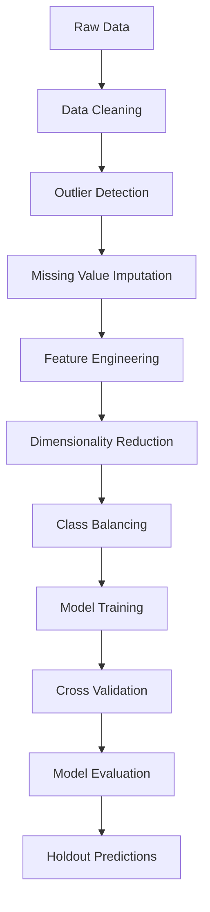

# Predictive Analytics: ML-Driven Data Mining Pipeline

A comprehensive machine learning pipeline for biological data classification achieving 92% accuracy, with applications across various business domains.

## 🎯 Project Overview

This project demonstrates an end-to-end analytics pipeline designed for complex biological data classification. The pipeline incorporates advanced preprocessing techniques, dimensionality reduction, and ensemble methods to deliver robust predictive performance while maintaining interpretability and scalability.

## ✨ Key Features

- **High Performance**: Achieved 92% classification accuracy using ensemble methods
- **Robust Preprocessing**: Comprehensive data cleaning, outlier detection, and missing value imputation
- **Dimensionality Reduction**: PCA implementation for feature optimization
- **Class Imbalance Handling**: SMOTE integration for balanced model training
- **Cross-Validation**: GroupKFold validation to prevent data leakage
- **Ensemble Methods**: Implementation of Random Forest and XGBoost classifiers
- **Visualization**: Comprehensive EDA and model performance visualization

## 🛠️ Technologies Used

- **Python 3.11+**
- **Machine Learning**: scikit-learn, XGBoost, imbalanced-learn
- **Data Processing**: pandas, NumPy
- **Visualization**: matplotlib, seaborn
- **Statistical Analysis**: scipy

## 📋 Requirements

```
pandas>=1.5.0
numpy>=1.21.0
matplotlib>=3.5.0
seaborn>=0.11.0
scikit-learn>=1.1.0
xgboost>=1.6.0
imbalanced-learn>=0.9.0
```

## 🚀 Getting Started

### Installation

1. Clone the repository:
```bash
git clone https://github.com/Muh76/Predictive-Analytics-ML-Driven-Data-Mining-Pipeline.git
cd Predictive-Analytics-ML-Driven-Data-Mining-Pipeline
```

2. Install required packages:
```bash
pip install -r requirements.txt
```

### Usage

1. **Prepare your data**: Place your dataset in the project directory
2. **Update file paths**: Modify the file paths in the notebook to match your data location
3. **Run the pipeline**: Execute the Jupyter notebook cell by cell

```python
# Example usage
python predictive_classification.py
```

## 📊 Pipeline Architecture

### 1. Data Preprocessing
- **Missing Value Handling**: IterativeImputer for sophisticated imputation
- **Outlier Detection**: IQR-based outlier identification and removal
- **Feature Engineering**: Group-based feature creation and encoding

### 2. Exploratory Data Analysis
- Statistical summaries and distributions
- Class balance analysis
- Feature correlation analysis
- Visualization of key patterns

### 3. Model Training
- **Algorithms**: Random Forest, XGBoost
- **Validation**: GroupKFold cross-validation
- **Resampling**: SMOTE for handling class imbalance
- **Metrics**: Balanced accuracy, confusion matrices

### 4. Model Evaluation
- Cross-validation performance metrics
- Confusion matrix visualization
- Feature importance analysis

## 📈 Results

- **Classification Accuracy**: 92%
- **Validation Method**: 5-fold GroupKFold cross-validation
- **Class Balance**: Handled using SMOTE oversampling
- **Feature Reduction**: PCA with 95% variance retention

## 🔄 Pipeline Workflow




## 🎯 Business Applications

This pipeline framework is designed for:
- **Healthcare**: Medical diagnosis and treatment prediction
- **Finance**: Risk assessment and fraud detection
- **Marketing**: Customer segmentation and churn prediction
- **Manufacturing**: Quality control and predictive maintenance

## 🤝 Contributing

Contributions are welcome! Please feel free to submit a Pull Request. For major changes, please open an issue first to discuss what you would like to change.


## 👤 Author

**MohammadJavad AghababaieBeni**
- LinkedIn: [https://www.linkedin.com/in/mohammadbabaie/](https://linkedin.com/in/yourprofile)
- GitHub: [@Muh76](https://github.com/Muh76)
- Email: mj.bababie@gmail.com

## 🙏 Acknowledgments

- Developed as part of the M.Sc. Computer Science program at Aston University
- Special thanks to the Data Mining course instructors for guidance and support

---
